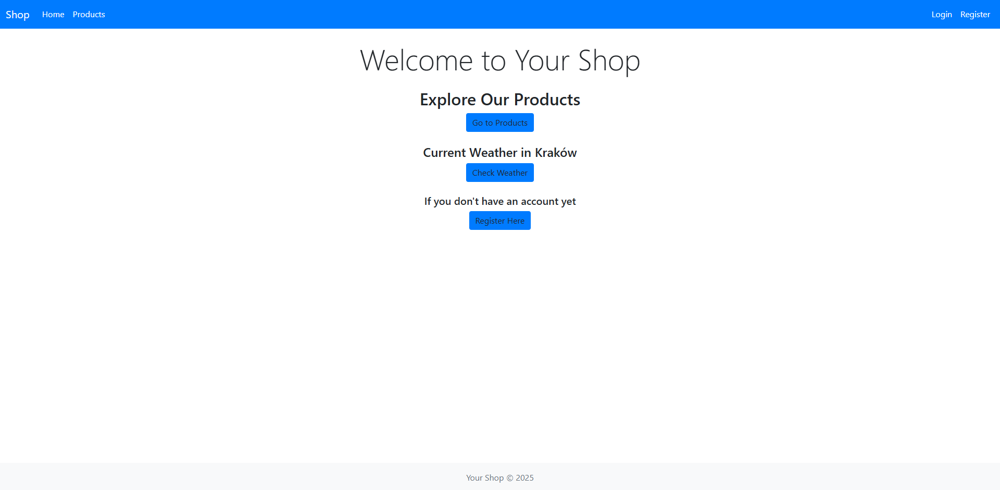
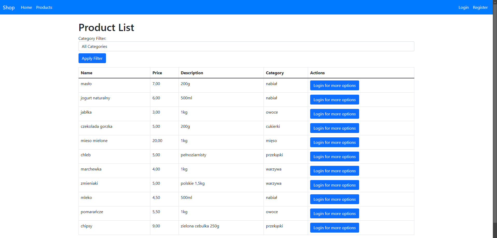
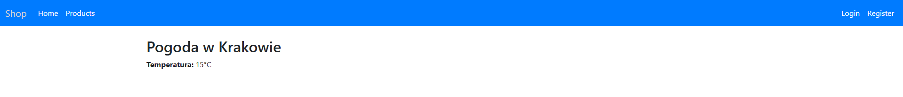
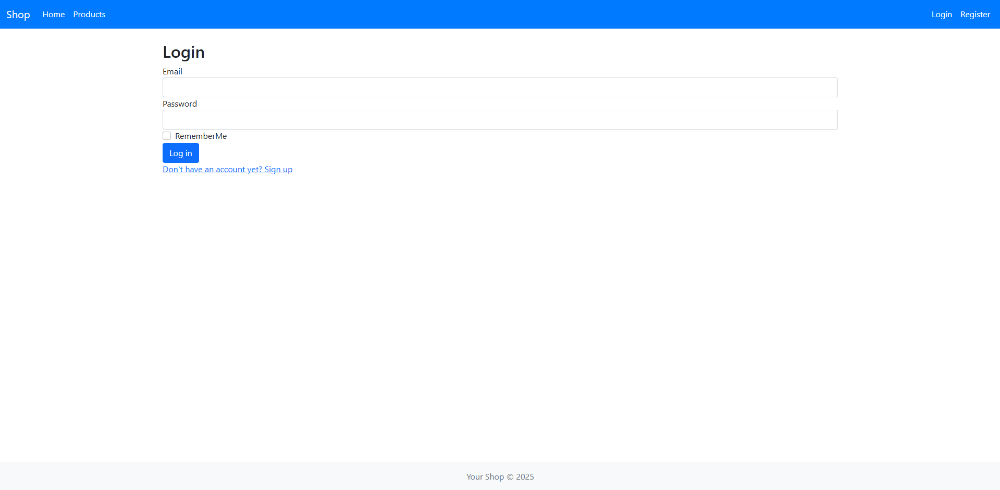
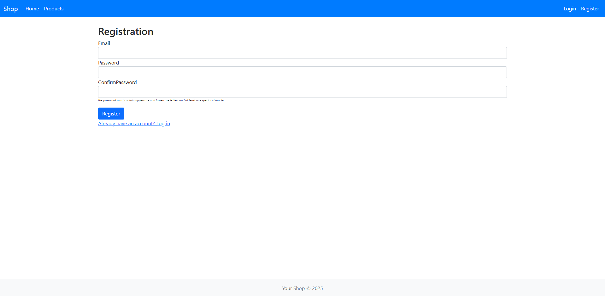
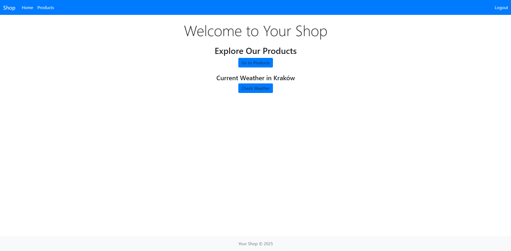
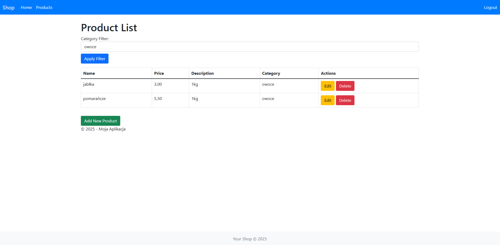
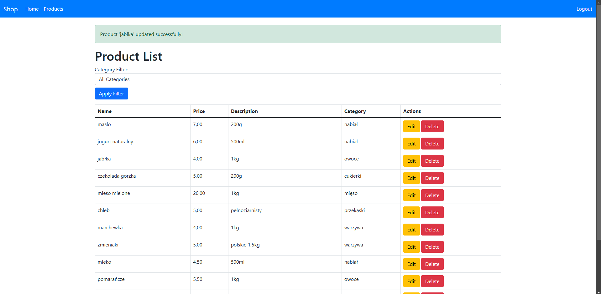
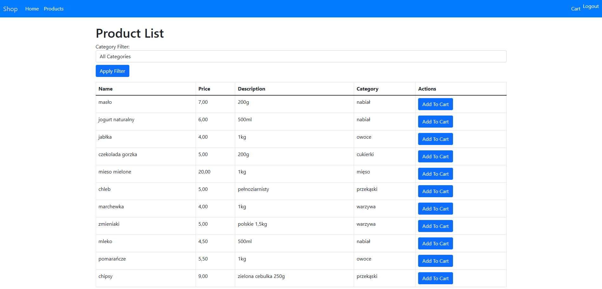
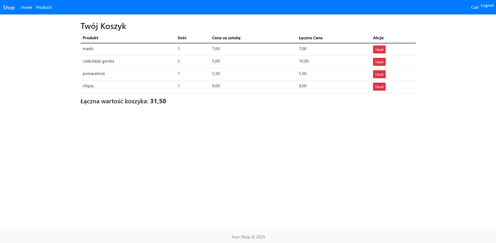

# 🛒 Shop

A simple e-commerce application with features for user authentication, product management, shopping cart, and notifications.

## Table of Contents

- [Demo](#demo)
- [Features](#features)
- [Technologies](#technologies)
- [Installation](#installation)
- [Usage](#usage)

## Demo

### View when **not logged in**:

- **Home Page**: The view of the homepage for users who are not logged in.
  

- **Products Page**: The Products page for non-logged-in users.
  

- **Weather**: Check the weather for Kraków.
  

- **Login Page**: The Login page for users to log into their account.
  

- **Registration Page**: The Registration page for users to create a new account.
  

### View when **logged in**:

- **Home Page**: The view for the admin when logged in.
  

- **Admin Product Page**: The Products page that the admin can manage.
  
  
- **Notifications**: When we create, delete or edit product.
  

- **Client View**: The view for the client when logged in.
  

- **Client Cart**: The client's shopping cart.
  

## Features

- 🔐 **User authentication**: Register and log in securely. Users can choose from two roles:
  - **Client**: Can add and remove products from the shopping cart.
  - **Administrator**: Can add, edit, and delete products.

- 🛍️ **Product management**: 
  - **Administrator**: Can manage products by adding, editing, and removing them.

- 🛒 **Shopping cart**: 
  - **Client**: Can add and remove products from the cart and place orders.

- 🔔 **Notifications**: Users will receive notifications about product management actions (adding, editing, and deleting products).

- **🌤️ Weather Feature** The application fetches the current weather data using the OpenWeatherMap API.


## Technologies

- **Backend**: ASP.NET Core
- **Frontend**: HTML, CSS, JavaScript
- **Database**: Entity Framework Core

## Installation

1. Clone the repository:
 ```bash
 git clone https://github.com/MiloszJasica/Shop.git
 cd Shop
 ```
   
2. Install dependencies:
  ```bash
  dotnet restore
  ```
4. Apply database migrations:
  ```bash
  dotnet ef database update
  ```
5. Run the application:
  ```bash
  dotnet run
  ```
## Usage
Once the application is running, open your browser and go to http://localhost:5000. Register a new account or log in to manage products.

## Admin Access

A default admin account has been created in the system with the following credentials:

- **Email**: admin@example.com
- **Password**: Admin123!

You can either:
1. **Register as a client** through the regular sign-up process.
2. **Log in as an admin** using the credentials above to access the admin panel and manage products, users, and orders.
